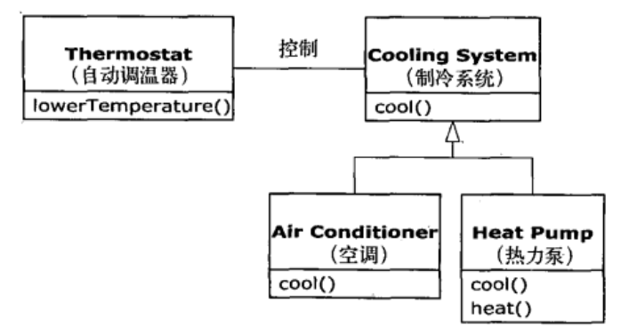

# 第一章 对象导论
> “我们之所以将自然界分解，组织成各种概念，并按其含义分类，主要是应为我们是整个口语交流社会共同遵守的协定的参与者，这个协定以语言的形式固定下来……除非赞成这个协定中规定的有关语言信息的组织和分类，否则我们根本无法交谈”。

## 1.1 抽象过程
### 面向对象实质：
> 程序可以通过添加新类型的对象使自身适用于某个特定的问题。

### 面向对象程序设计方式
> #### Alan.Kay的概括
>> * 万物皆对象
>> * 程序是对象的集合，它们通过发送消息来告知彼此需要做的
>> * 每个对象都有自己的由其他对象所构成的存储
>> * 每个对象都拥有其类型
>> * 某一特定类型的所有对象都可以接收同样的消息

> #### Booch的概括
>> * 对象具有状态，行为和标识

## 1.2 每个对象都有一个接口
> 所有的对象都是唯一的，但同时也是具有相同的特性和行为的对象所归属的类的一部分。

## 1.3 每个对象都提供服务
### 对象是服务的提供者
> 程序本身向用户提供服务，它通过调用其他对象提供的服务来实现这一目的。

#### 将对象看做服务提供者的好处
> 有助于提高对象的内聚性

## 1.4 被隐藏的具体实现
> 在任何相互关系中，具有关系所涉及的各方都遵守的边界是十分重要的事情。

### 隐藏的具体实现的好处
> 让客户端程序员无法触及到他们不该触及的部分（例如一个接口具体的实现）。同时也可以让客户端程序员很容易的看出哪些才是对他们重要的部分，哪些是可以忽略的。

> 可以允许库的设计者在不影响客户端程序员的情况下修改类的实现。

### java访问空字符
> * **public**  
> 具有最大的访问权限，可以访问任何一个在classpath下的类、接口、异常等。它往往用于对外的情况，也就是对象或类对外的一种接口的形式。
> * **protected**  
> 主要的作用就是用来保护子类的。它的含义在于子类可以用它修饰的成员，其他的不可以，它相当于传递给子类的一种继承的东西。
> * **default**  
> 有时候也称为friendly，它是针对本包访问而设计的，任何处于本包下的类、接口、异常等，都可以相互访问，即使是父类没有用protected修饰的成员也可以。该关键字不能声明,没有声明权限就默认是default
> * **private**  
> 访问权限仅限于类的内部，是一种封装的体现，例如，大多数成员变量都是修饰符为private的，它们不希望被其他任何外部的类访问。

### java访问控制符权限图片

## 1.5 复用具体实现
> 代码复用是面向对象程序设计语言所提供的最了不起的优点之一。

### 组合
> 新的类可以由任意数量，任意类型的其他对象以任意可以实现新类中想要的功能的方式所组成。因为是使用现有的类合成新的类，所以这种概念被称为组合。

#### 组合的好处
> 组合带来了极大的灵活性，新类的成员对象通常都被声明为private，使得新类的客户端程序员不能访问它们。也使得你可以再不干扰现有客户端代码的情况下，修改这些成员。也可以在运行时修改这些成员对象，以实现动态修改这些程序的行为。

> 继承不具备这样的灵活性，但因为继承在面向对象中非常重要，导致它被高度强调。这样造成了新手过度继承，使得设计复杂。事实上，建立新类时优先考虑组合，在需要继承时再使用继承。

## 1.6 继承
> 通过继承我们能够以现有类为基础，复制它，然后通过添加和修改这个副本来创建新类。当源类（基类，父类或超类）发生变动时，副本（导出类，继承类或子类）也会反映这些变动。

### 1.6.1 “是一个”与“像是一个”的关系
> * is-a（是一个）
>	> 当继承只覆盖基类方法时，就意味着导出类和和基类是完全相同的类型，因为他们具有完全相同的接口。可以被视为纯粹替代,被称为替代原则。比如一个圆形是一个几何形状。
> * is-like-a（像是一个）
>	> 有时必须在新的导出类型中添加新的接口元素，这样也就拓展了接口。这个新的类型依然可以替代基类，但这种替代并不完美，因为基类无法访问新添加的方法。比如空调可以制冷，热力泵可以制冷和制热，这是可以说热力泵就好像一个空调，因为房子的控制系统只能控制制冷，所以热力泵制热的部分无法被房子的控制系统一无所知。

### is-like-a

## 1.7 伴随多态的可互换对象
> 在处理类型的层次结构时，经常想把一个对象不当做它所属的特定的类型对待，而是将其当做其基类的对象来对待。

### 前期绑定
> 一个非面向对象编程的编译器产生的函数调用会引起所谓的前期绑定。这么做意味着编译器将产生一个具体函数名字的调用，而运行时将这个调用解析到将要被执行的代码的绝对地址。

### 后期绑定
> 当向对象发送消息时，被调用的代码直到运行时才能确定。编译器确保被调用方法的存在，并对调用参数和返回值执行类型检查，但并不知道将被执行的确切代码。为了执行后期绑定，Java使用一小段特殊代码来替代绝对地址调用。这段代码使用在对象中存储的信息来计算方法体的地址。

> Java中动态绑定时默认行为，不需要添加额外的关键字来实现多态。

### 向上转型
> 将导出类看做是它的基类的过程称为向上转型。

## 1.8 单根继承结构
> 在OOP中，自C++面世以来就已经变得非常瞩目的问题是，是否所有的类最终都继承单一的基类。在Java中，答案是yes，这个终极基类的名字是Object。事实证明继承结构带来了很多好处。

## 1.9 容器
> 通常来说，如果不知道在解决某个特定问题时需要多少个对象，或者它们存活多久，那么就不可能知道如何存储这些对象。如何才能知道需要多少空间才能创建这些对象？答案是你不可能知道，因为这些只有在运行时才知道。
> 对于面向对象设计的大多数问题而言，这个问题的解决方法似乎过于轻率：创建另一种对象类型。这种新的对象类型只有对其他类型的引用。你可以用其他大多数语言中的数组类型来实现相同的功能。但是这个通常被称为容器的新对象，在任何需要的时候都可以扩充自己以容纳你置于其中的所有东西。因此也不需要知道将来会把多少对象置于容器中，只需要创建一个容器对象，让它处理所有细节。

### 1.9.1 参数化类型
> 因为向上转型是安全的，但是向下转型是不安全的，同时向下转型需要耗费额外的运算资源。那么如果容器知道自己所存储的类型那么就变得很有意义了。这一解决方案就是参数化类型机制即泛型。

### 泛型的使用

## 1.10 对象的创建和生命周期
> 每个对象都需要资源，当我们不需要它之后需要清除掉。

> java使用动态内存分配方式，需要使用new关键字创建对象（基本类型是特例）。

> java的垃圾回收机制，java垃圾回收器通过判断对象是否被引用来决定是否回收该对象。

## 1.11 异常处理，处理错误
> java内置了异常处理，而且必须强制使用它。

> 在没有正确处理异常时，会得到编译出错信息，这种有保障的一致性使错误处理非常容易。

> 异常处理不是面向对象特征。

## 1.12 并发编程
> Java的并发内置在语言中。

## 1.13 Java与Internet
> Java非常适合web应用。

## 1.14 总结
> 使用java可以提供很多便利，但是是否选择Java还是要看你的具体场景，选择最合适的语言才是最重要的。
