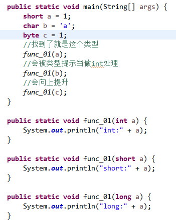
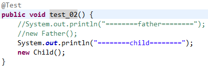
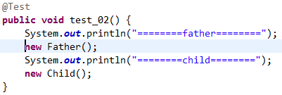
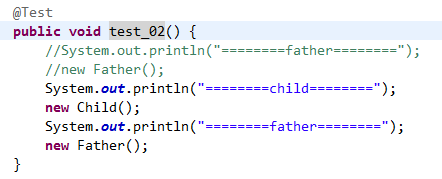

# 第五章 初始化与清理
> 随着计算机革命的发展，“不安全”的编程方式已逐渐成为编程代价高昂的主因之一。初始化和清理正是涉及安全的两个问题。

## 5.1 用构造器确保初始化
> Java会在用户有能力操作对象前自动调用相应的构造器。

> 构造方法必须与类同名，因为这样编译器才知道调用哪个方法。

> 构造方法什么都不返回（是new表达式返回来对象的引用，而不是构造器），因为如果要返回就必须让编译器知道如何处理这个值。

## 5.2 方法重载
> 方法名相同，但是参数类型列表唯一。

> 基本类型参数传入较小类型会被自动提示到较大类型。char会被直接提示至int类型。

> ### 基本类型重载演示
>   
> 结果:
>> short:1  
>> int:97  
>> short:1  

## 5.3 缺省构造器
> 默认构造器是没有形式参数的，它的作用是创建一个“默认对象”。如果类中没有写构造器，编译器会默认为你创建一个默认构造器。

> 如果你自己创建了构造器，编译器就不会为你创建构造器了。

## 5.4 this关键字
> 如果希望在方法的内部获取当前对象的引用，可以使用this关键字。

> static中不能使用this因为此时对象可能没有创建。

## 5.5 清理：终结处理和垃圾回收
> 因为垃圾回收是有开支的，所以只有在内存块用完时才会执行垃圾回收。如果一直不用完内存，则在程序结束时会将内存还给系统。

> finalize()是为了处理那些没有使用Java的通常做法而产生的对象。通常发生在使用本地方法时。

> 垃圾回收如何工作（这里涉及的知识很多，目前无法有太多的理解）。

## 5.6 成员初始化
> 类的成员变量是有初始值的。

> 方法的局部变量是没有初始值的。

## 5.7 构造器初始化
> 自动初始化无法阻止，因为它在构造器执行前就初始化了。

> 静态数据只占用一份存储区，static不能用于局部变量，它只作用于域，如果没有被初始化它会被自动初始化。

>   
> ========child========  
> 父类静态代码块执行!  
> 子类静态代码块执行!  
> 父类代码块执行!  
> 父类构造方法执行!  
> 子类代码块执行!  
> 子类构造方法执行  

>   
> ========father========  
> 父类静态代码块执行!  
> 父类代码块执行!  
> 父类构造方法执行!  
> ========child========  
> 子类静态代码块执行!  
> 父类代码块执行!  
> 父类构造方法执行!  
> 子类代码块执行!  
> 子类构造方法执行  

>   
========child========  
父类静态代码块执行!  
子类静态代码块执行!  
父类代码块执行!  
父类构造方法执行!  
子类代码块执行!  
子类构造方法执行  
========father========  
父类代码块执行!  
父类构造方法执行!  

## 5.8 数组初始化
> int[] a = {1,2,3,4,5};

> int[] a = new int[5];

> int[] a = new int[]{1,2,3,4,5};

> 可变参func(String...names){};你应该只在重载方法的一个版本使用它，或者不使用。

## 5.9 枚举类型
> 枚举是类

## 5.10 总结
> 

